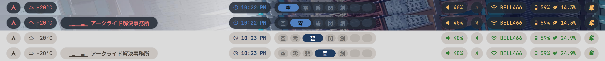
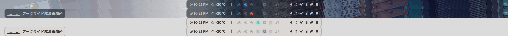
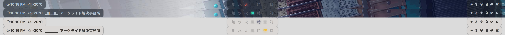
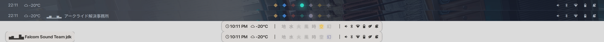

# Waybar Layouts

A collection of custom Waybar themes inspired by the Trails (Kiseki) JRPG series.

## Themes

### Kiseki

Inspired by Trails series, where the workspaces represents the kanji for each of the series.
The media player module appears only when there is media playing.

### Quartz

A refined version of Sepith layout where all the core modules are focused on the center area.
Minimal floating island design with a single center island. 
Workspaces use the seven Sepith element colors (Earth, Water, Fire, Wind, Time, Space, Mirage) with glowing text shadows on the active workspace.

### Sepith

Three floating islands (left, center, right) with semi-transparent backgrounds. Like Quartz, workspaces are colored by the seven Sepith elements, each glowing when active.

### Xipha

Unified continuous bar inspired by the Xipha tactical-orbment device. 
Features a subtle circuit-line gradient behind workspaces connecting the Sepith element dots.
Active workspaces have a pronounced glow effect.

## Usage

Each theme folder contains:

- `config.jsonc` - Waybar configuration
- `style.css` - Theme styling
- `preview.png` - Theme preview

To use a theme, symlink or copy the config and style files to your waybar config directory.
